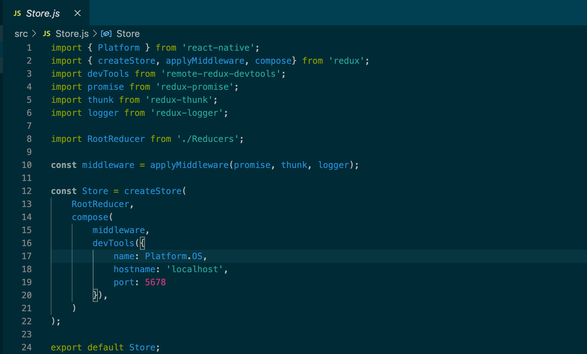
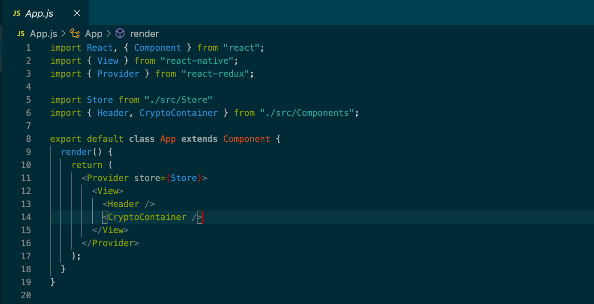
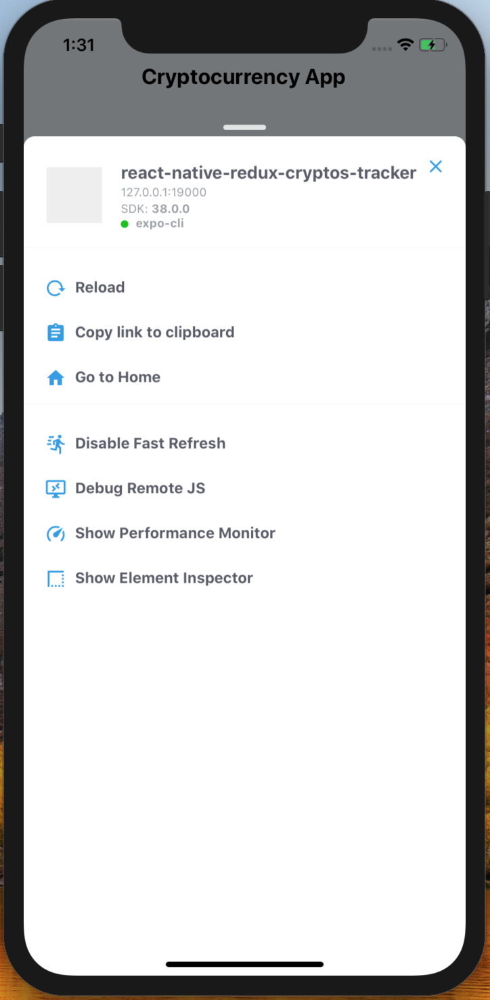
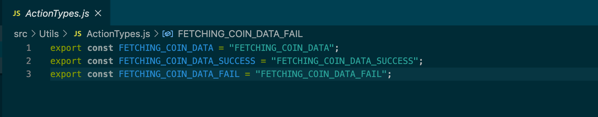
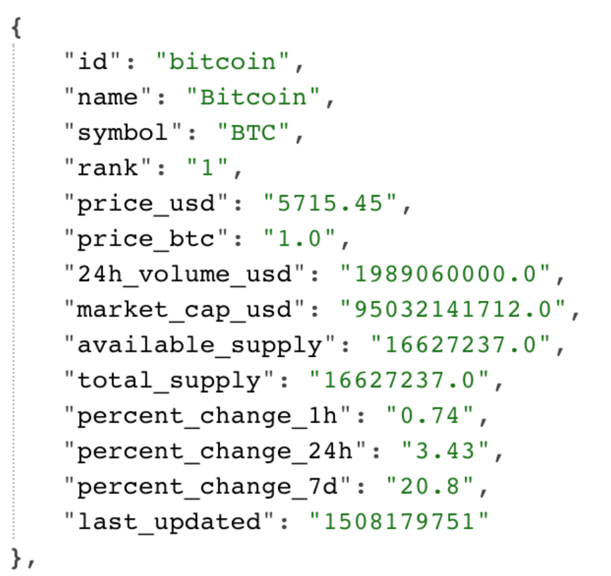

# Project Name
> Here goes your awesome project description!

## Table of contents
* [General info](#general-info)
* [Technologies](#technologies)
* [Setup](#setup)
* [Features](#features)
* [Status](#status)
* [Inspiration](#inspiration)

## General info
A crypto currency tracker that allows you to view how crypto currencies are performing in their market.

## Screenshots

## Technologies
* JS
* React
* React-Native
* Redux
* Expo

## Setup
Open your terminal and run a couple of commands for installing React Native and launching your preferred simulator.

`$ npm install -g create-react-native-app`

`$ create-react-native-app react-native-redux-crypto-tracker && cd react-native-redux-crypto-tracker`

Next, serve the project. Type the next command in the terminal. You can choose between iOS or Android simulators. Press i for iOS and a for Android.

(simulator) — `$ npm run ios — iOS`

(simulator )— `$ npm run android — Android`

(Physical device )— `$ npm run start` — QR code and options. Open your mobile camera and point it to the QR code.
You also need the Expo app as well.

## Building The App

Start by making a `src` directory where you place all your code.

`$ mkdir src && cd src`

Inside `src`, create a `components` directory. Inside the `components` is where you place your views.

## Implementing the Header 

Make two files inside `src/components` — `Header.js` and `index.js`.

`Header.js` is for the header of the app, and `index.js` is for making an import export clean.

Inside `Header.js`, implement a stateless component.

To style the header, import the StyleSheet prop from `‘react-native’`.
Second, define the styles with `StyleSheet.create()` and pass the style object as an argument.
Third, deconstruct your props from the styles variable. And last, place style props to your elements via the style property.

The screenshot above is what the app should look like so far after it is run in Expo.

## Fetching Data from the API with Redux

I start by installing dependencies. Here’s the list of dependencies you're going to need.

`$ npm i --save redux react-redux redux-thunk redux-promise && npm i --save-dev remote-redux-devtools remotedev-rn-debugger remote-redux-devtools redux-logger`

### Tools explained

`redux` — Redux library

`react-redux` — Glue for React and Redux.

`remote-redux-devtool remotedev-rn-debugger`

These are Redux debugging middleware, allows you to use the Redux Chrome Devtools in Remote mode.

`redux-thunk` — Redux thunk lets us return a function inside an action instead of returning an object.

`redux-logger` — logs the previous state, action and the next state in the console.

#### Note: 
Logger must be the last middleware in the chain, otherwise it will log thunk and promise, not actual actions. I learned this the hard way.

`redux-promise` — Allows you to resolve async actions (promises) with Redux. Example: Fetching data from an API.

## Creating the Store

Create `src/Store.js` and add the following contents.

Above, you see: import `Platform` from `‘react-native’`. Platform is needed for the remote dev tools.

`createStore()` is needed to create the initial store. Pass the store to the `<Provider>`.

`applyMiddleware()` — Is for applying the middleware. I used thunk actions, promise and logger.

`compose()` — Composes functions from right to left.

I passed my middleware and devTools as the arguments for `compose` function.

I imported `RootReducer` and passed it as the first argument to the `createStore()` function.

Last, I connected the store to `localhost`.

## Adding the Provider

In `App.js` I imported the `Store.js` and `Provider` from `‘react-redux’`.

The `Provider` accepts one argument — which is store. The `Provider` role is to glue React and Redux together.

## Final Tooling Steps

Finally, I added some scripts to `package.json`

`“postinstall”: “remotedev-debugger — hostname localhost — port 5678 — injectserver”`

Then I added a new object called `“remotedev”` with these two props:

`"remotedev": { "hostname": "localhost", "port": 5678 }, `

## Creating the RootReducer

`$ mkdir src/Reducers && cd src/Reducers && touch index.js && touch CryptoReducer.js`

Because reducers are async by default (anonymous functions), all reducers get invoked after an action. This is the reason for using the `switch conditional` to handle appropriate actions.

### Creating the crypto container and mapping it to redux state

`touch src/components/CryptoContainer.js`

I used the connect method to hook React components with Redux state.
`connect()` accepts two arguments:

The first argument is `mapStateToProps`. This Maps the Redux state to our React props. It allowed me to access the crypto state under this.props.crypto

The second argument is mapDispatchToAction.

Next, I made the `Header.js` and `CryptoContainer` exportable in `src/components/index.js`

Finally, I added the `CryptoContainer.js` component to `App.js`:

## Test
Run iOS simulator.

#### This is what I saw:

At the bottom of the screen there was a debugging message. When working with a simulator,
the following commands will open options for react native apps:

##### MAC: cmd + d

##### Windows: Ctrl + M

I clicked on 'Debug Remote JS'. This opens up a browser in debug mode.

As you can see with the Redux Devtools, the `crypto` state being shown as an (empty array).

## Fetching Data with Redux and Redux Thunk

Finally, I was ready to fetch data. I used the coingecko public API.

I made a `src/Utils/Constants.js` file and added the API base URL there.

I put the API in it's own file in case the API changes. I would only have to change it in one place.

Next, in `src/Actions` I made a file called `FetchCoinData.js`, This is where i'm fetching my cryptocurrency coin data. I used axios to do this.

`npm i --save axios`

Then I imported axios and the apiBaseURL from `Constants.js` and added the boilerplate for the action.

## Creating Actions

Next I returned a thunk action. Thunk actions are functions. 

When requesting data, there are 3 states.

1.Requesting the data.

2.Data Requesting Successful `(200 — got the data!)`

3.Data Requesting Fail

Think of "Thunk" as a promise, there’s calling the Promise, resolving the promise and ejecting the promise.

Next I finished implementing the rest of the thunk action and implemented fetching the data.

This is one way how to fetch data with Redux and Redux Thunk. The error handling
is the main reason why I used Thunk.

Next I created my action types. I started by creating a file in `src/Utils` called `ActionTypes.js`

Then I imported the action types into my action.

Once my action for fetching the data was complete! I needed to pass the payload to the reducer and also map the action to the component.

## Implementing the Reducers

As raw data, the payload looks like this :

This is the data being passed to the reducer.

In `CryptoReducer.js` I defined the `initialState`.

I needed :

1. State, for the data being fetched to show a spinner.

2. The state that holds the actual data from the request.

3. And error handling.

Next, I implementing the `switch()` conditional and imported the action types.

I’m using the `Object.assign()` method for creating new objects.

`FETCHING_COIN_DATA` — is for when I am fetching the data and showing the spinner. React handles all the vDOM updates, I just needed to pass state.

Finally, the only thing left was to call the `FetchCoinData` action!

## Calling `FetchCoinData` action!

First I Imported the action to `CryptoContainer.js`.

Then I Mapped the `FetchCoinData` inside connect argument.

Last I called `this.props.FetchCoinData()` inside `componentDidMount()`.

After refreshing the simulator (mac: cmd + R, Windows: Ctrl + R) and opening Redux Devtools: here's the data under crypto state.

The data is now mapped under this.props.crypto. Next, I implemented the views.

## Views

I Created a stateless component called `CoinCard.js`.
Next, I declared my props. I named them the same as the data in the API.
Then I added the coin icons and made a file in `Utils` called `CoinIcons.js` and add these links.

Next, I imported the `Image` tag from `‘react-native’`

I added these styles to my elements:

Then I Imported the `CoinCard` to my `CryptoContainer`, placed it in the `render()` method and also passed the props.

I started by making a method called renderCoinCards inside the container.
Then I placed it in the render function:

Next I iterated my `crypto.data` array:

Above i'm just calling the map() method on the data array and iterating all the objects inside. For each object, I return a CoinCard component with the following props.

Next, I installed a package called `react-native-loading-spinner-overlay`

`$ npm i --save react-native-loading-spinner-overlay`

and imported it into the container.
`import Spinner from ‘react-native-loading-spinner-overlay';`

I wrote a simple `if` condition. I have a `isFetching` boolean prop under the crypto.

## Heres what the app looked like at this point:

I finally got the data to render, but I couldn't scroll in the app. That’s because I was using a `<View>` tag and view tags don’t have any touch features. I needed to use the `<ScrollView>` tag. So I
imported `ScrollView` and `StyleSheet` from the `react-native` package.

After getting scroll functionality, I added my CSS and finished styling the app. Here are the final results:

## Features
List of features ready and TODOs for future development
* Crypto Currency Icon
* Crypto Currency 24h change
* Crypto Currency 7 day change
* crypto Currency Current Price

To-do list:
* Add more Crypto Currencies
* Add Search Crypto Currency functionality
* Add line graph
* Add user account

## Status
Project is: _in progress_

## Inspiration
My desire to learn more about crypto currency and React, React-Native and redux.

